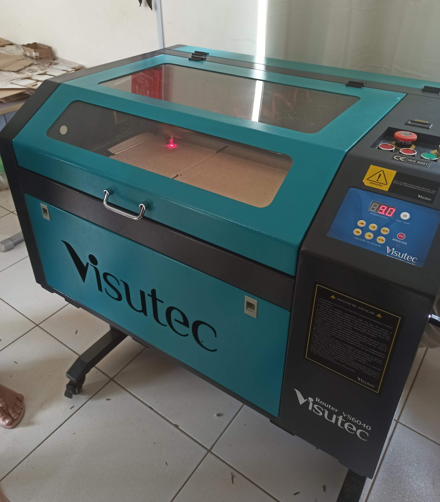

# Máquina a Laser

A máquina de corte a laser é um equipamento que utiliza alta tecnologia. As capacidades de corte, ou seja, as espessuras das chapas metálicas que podem ser trabalhadas dependem basicamente do tipo de material e da potência do laser a ser empregado.

A principal característica do corte por Laser é que o material removido é muito pequeno, menos de 10%, o que confere ao Laser uma elevada precisão e alta velocidade de corte, principalmente em espessuras finas.

Ela funciona integrada a um sistema CAD/CAM, em que se desenvolve um projeto detalhado e que é utilizado como orientação no material que será feito o trabalho. Este processo não necessita do desenvolvimento de matrizes e, além disso, é rápido e eficaz.

Para que o corte seja feito, um gerador de alta potência produz um raio que é levado para a cabeça de corte, que direciona o feixe de laser por um caminho ótico (através de espelhos ajustáveis). O raio, que até então apresentava baixa densidade de energia, atravessa uma lente de foco que ajusta a intensidade e o tamanho do feixe. Quando chegar ao cabeçote da máquina laser, a luz é concentrada através de lentes num único ponto, este direcionamento da luz laser, ocorre em um diâmetro inferior a 0,25mm.

O feixe focado passa a apresentar uma alta densidade de energia e é direcionado para o material a ser trabalhado. Assim é efetuado o corte. A densidade energética do feixe é tão grande que “derrete” o material na linha de corte. Em alguns milésimos de segundo a máquina de corte a laser executa o trabalho. O sistema permite que projetos complexos, cheios de detalhes e ângulos difíceis, sejam realizados de forma perfeita.

{width="89mm" height="100mm"}

## Softwares Utilizados:

-   Inkscape: Um software de design gráfico de código aberto que permite a criação de gráficos vetoriais. Ideal para criar desenhos simples e exportar em formatos compatíveis com a máquina a laser.

-   CorelDraw: Um software de design gráfico vetorial com uma ampla gama de ferramentas para ilustrações e gráficos. Usado para projetos mais complexos e detalhados.

-   AutoCAD: Um software de design assistido por computador que permite a criação de desenhos técnicos precisos. Adequado para projetos que requerem alta precisão e detalhamento técnico.

## Execução do Trabalho:

-   K40_Whisperer: Um software utilizado para controlar a máquina a laser. Compatível com arquivos SVG, DXF e G-Code, permite ajustar parâmetros como potência e velocidade para diferentes materiais.

## Materiais e Ajustes:

-   Papelão: Requer ajustes de potência baixos para evitar queimaduras excessivas.

-   MDF: Necessita de potência média a alta, dependendo da espessura. Usado para fabricar componentes estruturais e decorativos.

-   Acrílico: Potência ajustada conforme a espessura do material, normalmente média a alta. Utilizado para criar peças transparentes e coloridas com acabamentos limpos.

## Medidas de Segurança

-   Ventilação Adequada: Utilização de sistemas de exaustão para remover fumaça e vapores tóxicos gerados durante o corte ou gravação.

-   Superfície de Trabalho Segura: A máquina deve ser operada em uma superfície estável e à prova de fogo.

-   Supervisão Contínua: Nunca deixar a máquina funcionando sem supervisão para evitar incêndios.
