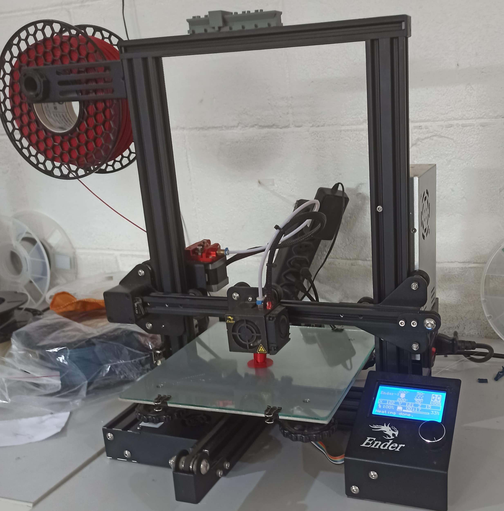

# Impressora 3D

Uma impressora 3D é uma máquina totalmente diferente das que temos em casa ou no escritório e que imprimem em papel — como as impressoras matriciais, a laser ou com jatos de tinta. A impressão 3D é uma tecnologia inovadora e que permite criar um objeto físico com rapidez e precisão a partir de um modelo digital no computador.

Criado esse modelo tridimensional, basta enviá-lo ao software da impressora 3D, definindo dimensões e detalhes de texturas. O desenho em 3D desse objeto será fatiado em várias camadas de impressão e produzido uma a uma até que se forme por completo. Em geral, as impressoras 3D trabalham como um injetor de matéria quente (um filamento plástico) ou emissão de luzes sobre um material moldável. As aplicações mais comuns são fusão a laser, fundição a vácuo e moldagem por injeção.

Conhecida também como prototipagem rápida, essa tecnologia revolucionou a indústria. Antes dela, para se produzir um protótipo, era preciso modelar uma peça manualmente para então criar uma matriz de produção.

Na prática, a impressão 3D é uma forma de tecnologia de fabricação aditiva em que um modelo tridimensional de um objeto é criado por sucessivas camadas de material sobrepostas, ordenadas de acordo com a programação de um software de impressão.

{width="100mm" height="100mm"}

## Softwares Utilizados:

-   Autodesk Fusion 360: Um software de modelagem 3D, CAD, CAM e CAE baseado em nuvem, ideal para criar modelos detalhados e realizar análises de engenharia.

-   Ultimaker Cura: Um software de fatiamento de código aberto que prepara os arquivos para impressão, ajustando parâmetros como temperatura, velocidade de impressão e densidade de preenchimento.

## Material Utilizável:

-   PLA (Polylactic Acid): Um termoplástico biodegradável derivado de recursos renováveis como o amido de milho. Fácil de imprimir, possui uma boa qualidade de acabamento e é seguro para o meio ambiente. Ideal para prototipagem e produção de peças finais não submetidas a altas tensões ou temperaturas.

## Medidas de Segurança:

-   Ventilação: Garantir boa ventilação para evitar a inalação de vapores potencialmente tóxicos liberados durante a impressão.

-   Manuseio de Alta Temperatura: Cuidado ao manusear partes aquecidas da impressora, como o bico extrusor e a cama aquecida, para evitar queimaduras.

-   Ambiente Seguro: Operar a impressora em um ambiente livre de inflamáveis e com supervisão adequada
