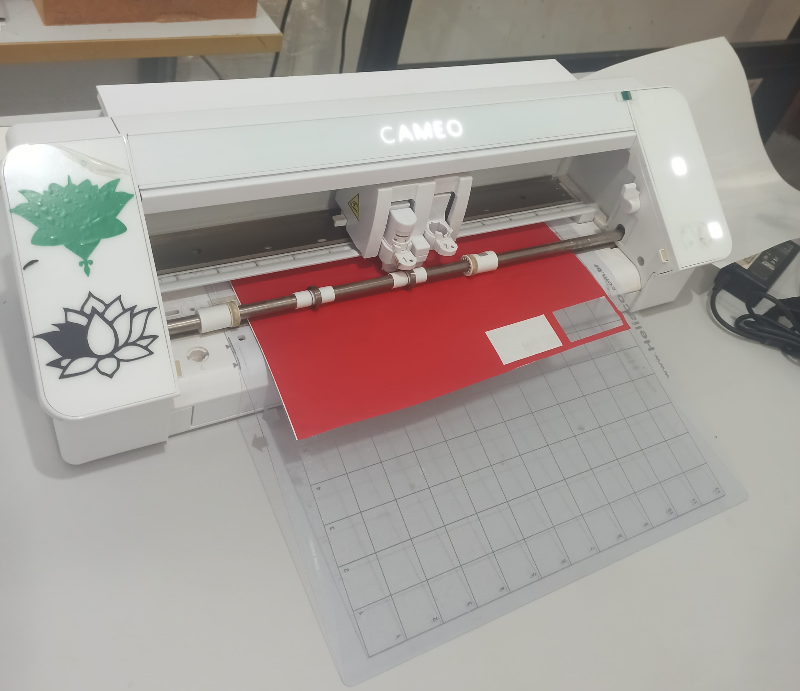

# Impressora para Corte em Adesivos

As impressoras para corte em adesivos são equipamentos essenciais para a produção de adesivos personalizados de alta precisão. Utilizadas amplamente em setores como publicidade, decoração, sinalização e artesanato, essas impressoras são projetadas para transformar designs digitais em adesivos de vinil detalhados e precisos.

O processo de corte em adesivos começa com a criação de designs digitais, que podem ser feitos em softwares de design gráfico como Adobe Illustrator, CorelDRAW, ou outros programas específicos para corte de vinil. Os designs são então importados para o software da impressora de corte, onde podem ser ajustados conforme necessário.

A impressora para corte em adesivos utiliza uma lâmina de corte controlada por um sistema de precisão que se move sobre o material de vinil. A lâmina corta o vinil seguindo as linhas e contornos do design digital com extrema precisão, permitindo a criação de detalhes minuciosos e complexos. A qualidade do corte depende da calibração adequada da máquina, incluindo ajustes de pressão e velocidade da lâmina, que variam de acordo com a espessura e tipo do vinil utilizado.

{width="116mm"}

## Material Utilizável:

-   Vinil: Um plástico flexível e durável, disponível em várias cores e acabamentos. Ideal para a criação de etiquetas, decalques, sinais e outros produtos adesivos. O vinil pode ser cortado em formas detalhadas e complexas, mantendo sua durabilidade e adesão.

## Medidas de Segurança:

-   Lâminas Afiadas: Cuidado ao substituir ou limpar lâminas de corte para evitar cortes e lesões.

-   Manuseio de Materiais: Uso de luvas ao manusear folhas de vinil para evitar cortes e abrasões.
