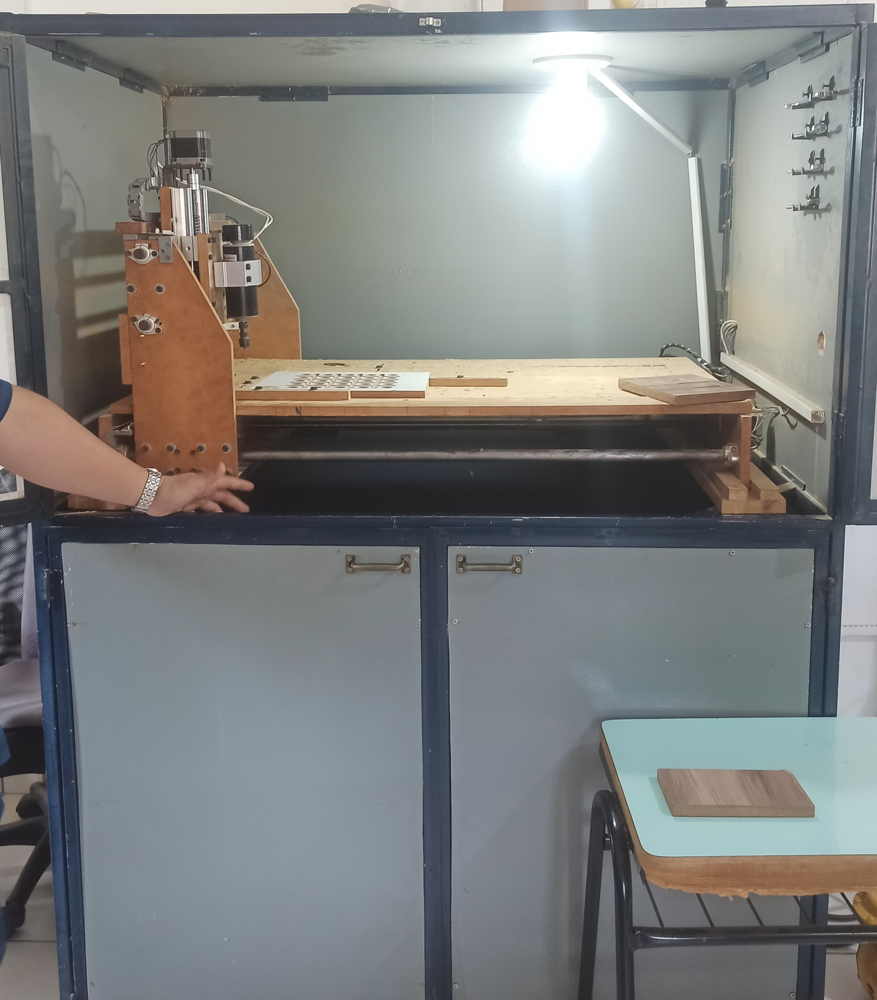

# Fresadora

A fresagem é um processo de usinagem mecânica, feito por fresadoras e ferramentas especiais chamadas fresas. A fresagem consiste na retirada do excesso de metal ou sobremetal da superfície de uma peça, a fim de dar a esta uma forma e acabamento desejados. Na fresagem, a remoção do sobremetal da peça é feita pela combinação de dois movimentos, efetuados ao mesmo tempo. Um dos movimentos é o de rotação da ferramenta, a fresa. O outro é o movimento da mesa da máquina, onde é fixada a peça a ser usinada.

O movimento de avanço pode levar a peça contra o movimento de giro do dente da fresa. É o chamado movimento discordante. Ou pode também levar a peça no mesmo sentido do movimento do dente da fresa. É o caso do movimento concordante.

{width="88mm"}

## Materiais Utilizáveis:

-   Madeira: Requer ferramentas adequadas para diferentes tipos, permitindo a criação de componentes estruturais e decorativos.

-   Compensado: Necessita de ajustes específicos para evitar lascamentos. Utilizado para projetos que requerem uma combinação de leveza e resistência.

-   MDF: Material versátil e fácil de trabalhar com fresadoras. Ideal para a criação de peças detalhadas e de alta qualidade. O MDF pode ser fresado para criar formas complexas e precisas, sendo amplamente utilizado em móveis e decoração.

## Medidas de Segurança:

-   Proteção Ocular e Auditiva: Uso de óculos de proteção e protetores auriculares para proteger contra detritos e ruído.

-   Sistema de Exaustão: Utilização de sistemas de coleta de pó para evitar inalação de partículas.

-   Fixação Segura: Garantir que a peça de trabalho esteja firmemente presa para evitar movimentos inesperados.
