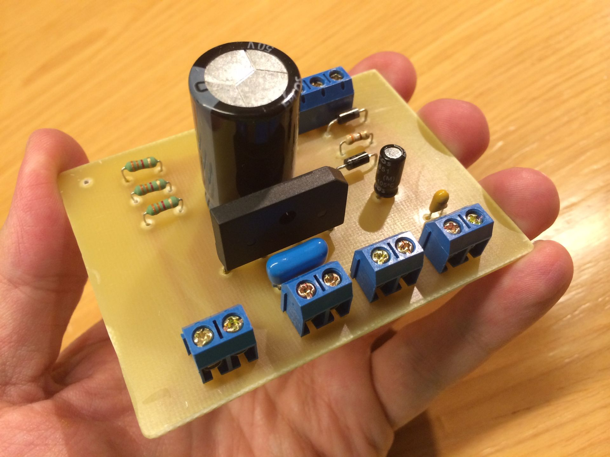

# Fabricação de Placas de Circuito Eletrônico

Os circuitos impressos, também referidos pelas siglas PCB ou PCBA, foram criados em substituição às antigas pontes de terminais, onde se fixavam os componentes eletrônicos, em montagem conhecida, no jargão de eletrônica, como "montagem aranha", em razão da sua aparência final, onde existiam principalmente válvulas eletrônicas e seus múltiplos pinos terminais do soquete de fixação. Esses circuitos suportam mecanicamente e conectam eletricamente componentes eletrônicos usando trilhas, pads e outros, gravados em folhas de cobre laminado, em um substrato não condutor.

O circuito impresso consiste de uma placa isolante de fenolite, fibra de vidro, fibra de poliéster, filme de poliéster, filmes específicos à base de diversos polímeros, entre outros, que possuem a superfície com uma, duas ou mais faces, revestida por fina película de cobre, constituindo as trilhas condutoras, revestidas por ligas à base de ouro, níquel, estanho, chumbo ou verniz orgânico (OSP), entre outros, que representam o circuito onde serão soldados e interligados os componentes eletrônicos.

Um circuito impresso mínimo com um único componente usado para prototipagem é chamado de placa de breakout.

Os circuitos impressos são usados em quase todos os produtos eletrônicos. Alternativas a estes incluem fio revestido e construção ponto a ponto. Exigem um esforço no design adicional para estabelecer o circuito, mas a fabricação e a montagem podem ser automatizadas.

{width="133mm" height="100mm"}

## Materiais e Ferramentas Utilizáveis:

-   Placa de Circuito Impresso Virgem: Base para a criação do circuito. A placa é revestida com uma camada de cobre que será removida seletivamente para formar os caminhos do circuito.

-   Perfurador de Placa: Ferramenta para fazer furos precisos onde os componentes serão montados. A precisão é crucial para garantir que os componentes se encaixem corretamente e façam boas conexões elétricas.

O processo envolve a transferência de um design de circuito para a placa, seguido pela perfuração e montagem dos componentes eletrônicos. Técnicas comuns incluem fotolitografia e fresagem de PCB.

## Medidas de Segurança:

-   Ventilação Adequada: Garantir boa ventilação ao trabalhar com produtos químicos usados na fabricação de PCBs.

-   Uso de EPIs: Uso de luvas e óculos de proteção ao manusear produtos químicos e durante a perfuração para evitar contato direto com substâncias nocivas e fragmentos.
