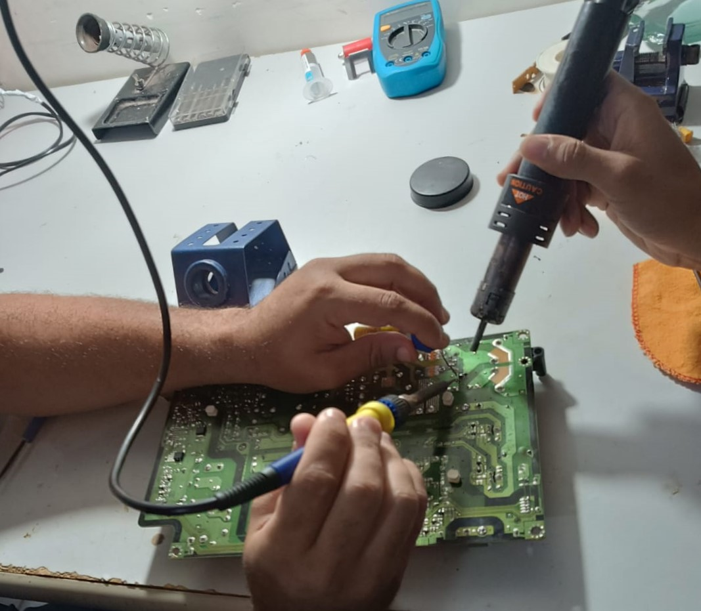

# Soldagem de Circuitos

A soldagem é uma técnica essencial na indústria e no mundo dos eletrônicos, desempenhando um papel crucial na montagem e reparo de equipamentos e dispositivos. Com o avanço da tecnologia, a demanda por habilidades especializadas em soldagem tem crescido constantemente, tornando-se uma competência indispensável para profissionais da área. Nesse contexto, é de extrema importância conhecer e dominar o uso de uma estação de solda.

Uma estação de solda é um equipamento utilizado para realizar a soldagem de componentes eletrônicos e outros materiais, garantindo a conexão elétrica e mecânica entre eles. Diferentemente de um simples ferro de solda, a estação de solda oferece maior controle e precisão, além de contar com recursos adicionais que facilitam o trabalho e garantem melhores resultados.

A estação de solda é composta por um ferro de solda ou outra ferramenta de aquecimento, um controlador de temperatura e uma base ou suporte para acomodar o ferro de solda e outros acessórios. O controlador de temperatura permite ajustar e manter a temperatura ideal para a soldagem, garantindo uma fusão adequada do material de solda e evitando danos aos componentes.

A principal diferença entre um ferro de solda e uma estação de solda é o nível de controle e precisão oferecido. Enquanto o ferro de solda é uma ferramenta simples, com temperatura fixa ou limitada, a estação de solda conta com um controlador de temperatura e outros recursos que permitem ajustar e manter a temperatura ideal para cada trabalho. Além disso, a estação de solda geralmente inclui acessórios e ferramentas auxiliares que facilitam o processo e melhoram a qualidade do trabalho.

A principal diferença entre um ferro de solda e uma estação de solda é o nível de controle e precisão oferecido. Enquanto o ferro de solda é uma ferramenta simples, com temperatura fixa ou limitada, a estação de solda conta com um controlador de temperatura e outros recursos que permitem ajustar e manter a temperatura ideal para cada trabalho. Além disso, a estação de solda geralmente inclui acessórios e ferramentas auxiliares que facilitam o processo e melhoram a qualidade do trabalho.

{width="115mm" height="100mm"}

## Ferramentas e Materiais Utilizáveis:

-   Estanho: Metal usado para criar conexões elétricas. Deve ser de alta qualidade para garantir conexões fortes e duráveis.

-   Componentes Eletrônicos: Resistores, capacitores, LEDs, ICs, etc. Cada componente deve ser posicionado corretamente e soldado para garantir o funcionamento do circuito.

-   Sugador de Estanho: Ferramenta para remover solda excessiva ou corrigir erros. Essencial para a retrabalho e manutenção de circuitos.

A soldagem requer habilidade e prática para garantir conexões fortes e duráveis, sem danificar os componentes ou a PCB. Técnicas comuns incluem soldagem por onda, soldagem manual e reflow soldering.

## Medidas de Segurança:

-   Proteção Ocular: Uso de óculos de proteção para evitar respingos de solda nos olhos.

-   Ventilação: Utilização de sistemas de exaustão para remover vapores tóxicos liberados durante a soldagem.

-   Manuseio de Ferramentas Quentes: Cuidado ao manusear o ferro de solda para evitar queimaduras. Sempre usar suporte adequado para descansar o ferro de solda quando não estiver em uso.
