# Projeto Final

Nesse projeto, apresentamos o desenvolvimento de um carro de controle remoto, utilizando diversas tecnologias e ferramentas de fabricação digital, como impressoras 3D e a laser, além de componentes eletrônicos programáveis. O objetivo foi criar um modelo funcional de um carro, aplicando os conhecimentos adquiridos na disciplina Tópicos Especiais em Eletrônica, focando na utilização de ferramentas disponível na integração de sistemas eletrônicos e contrução, baseado no design de um jeep, totalmente construído pelos autores, mediante testes e ajustes contínuos.

## Elaboração

Para realizar a contrução do projeto foi realizado alguma etapas importantes para concluir e obter sucesso, utilizando os seguintes materiais e técnicas.

### Chassi:

Com um modelo encontado na internet, foi adaptada para o nosso projeto, foi utilizado PLA e impressora 3D para criar um chassi leve e resistente, depois impresso com parâmetros ajustados de acordo com espessura e temperatura para o filamento de PLA.

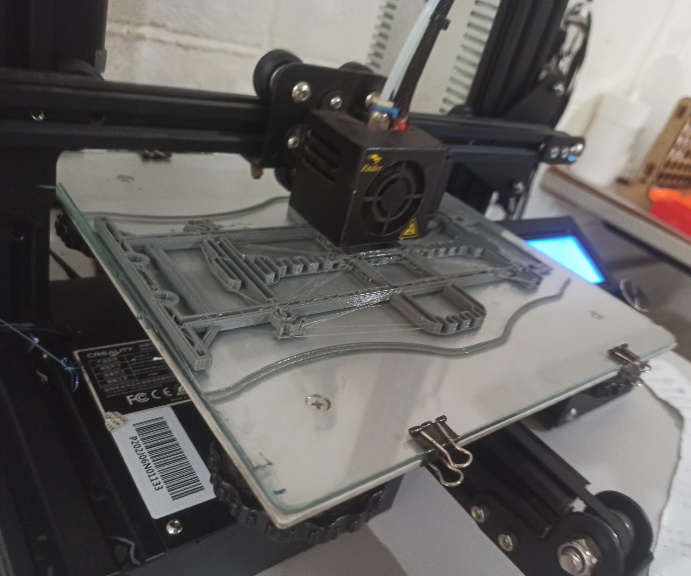{width="120mm"}

### Carcaça:

A construção da carcaça do carro, iniciou-se com um esboço manual. Este passo é de suma importancia para verificar se as dimensões e proporções esta de acordo com o chassi. Utilizando papel e lápis, um esboço foi criado com base de um carro jeep. Com o chassi em mãos foi permitido ajustes e uma melhor compreensão do formato da carcaça.

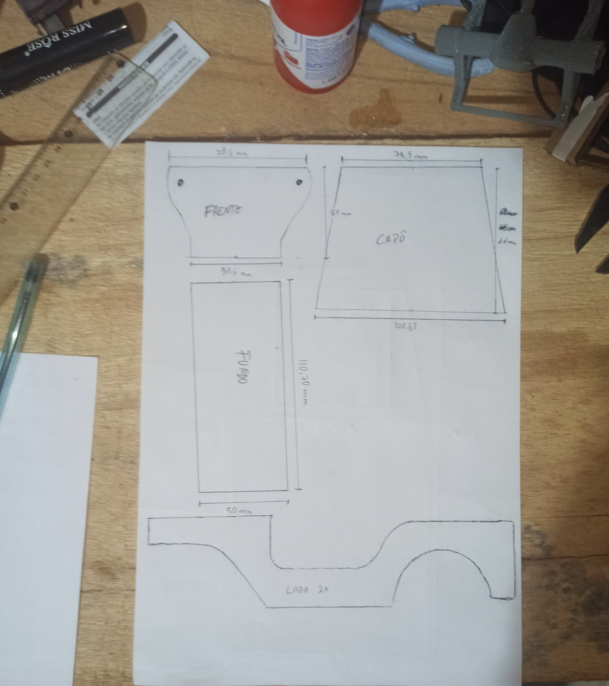{width="89mm"}

Em seguida, usamos o esboço como guia, para criar o arquivo ao software AutoCAD.. No AutoCAD, o desenho com medidas exatas, garantindo que todas as dimensões sejam precisas e consistentes com o chassi do carro. Este modelo digital permite visualizar o design em 2D, facilitando a identificação de possíveis problemas e realizando ajustes necessários antes da produção física.

Com o arquivo pronto, foi realizado o recorte utilizando a máquina a laser, e verificar se será preciso de algum ajustes e imprementações.

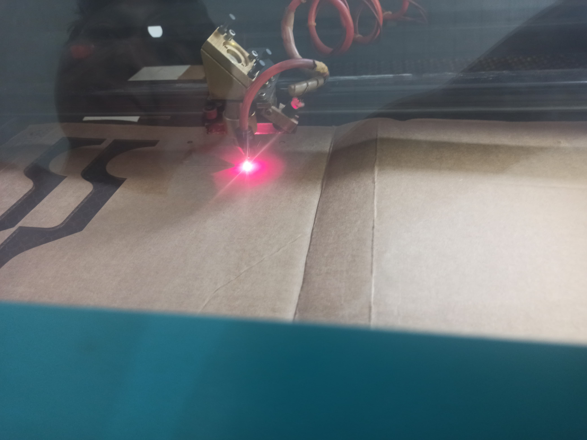{width="133mm"}

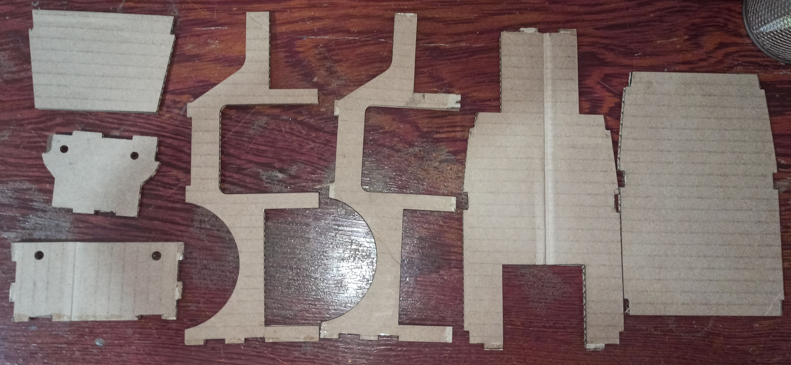{width="133mm"}

Com o protótipo pronto, foi possível fazer a montagem e verificar se a carcaça esta com todas as medidas devidamente adequada ao chassi, ao fazer o procedimento nescessário, foi realizado o corte no material final do projeto para carcaça.

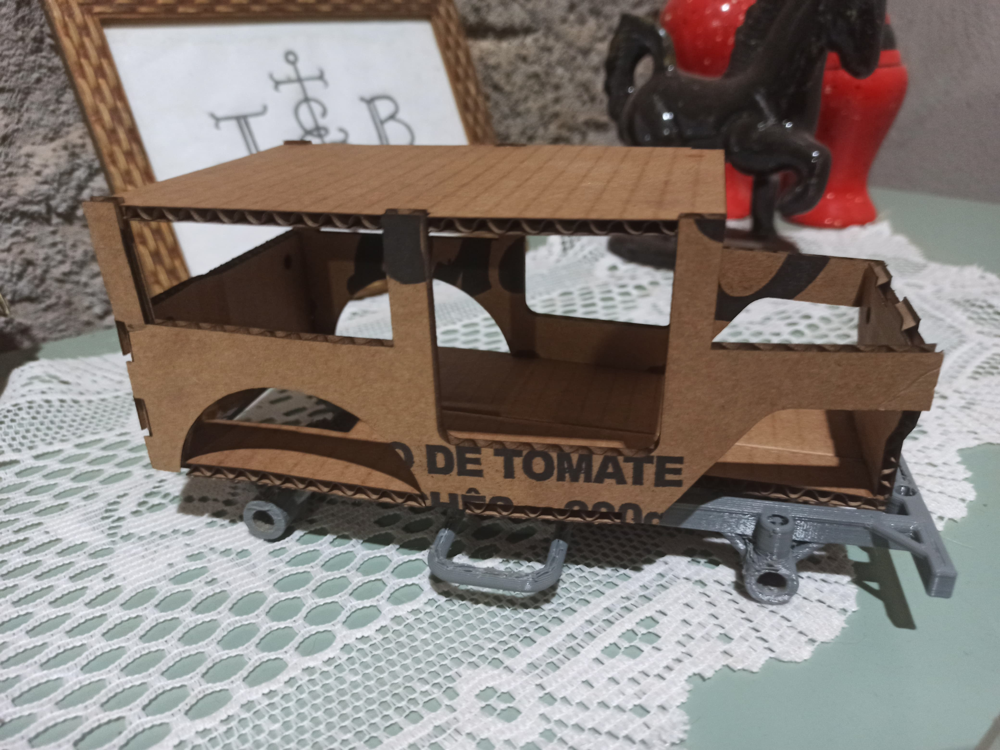{width="133mm" height="100mm"}

Ao verificar que está conforme o esperado, usamos MDF de 3 mm cortado a laser, ajustando a potência e a velocidade do laser para garantir cortes precisos e limpos, evitando queimaduras excessivas no material e finalmente terminado a carcaça do carro.

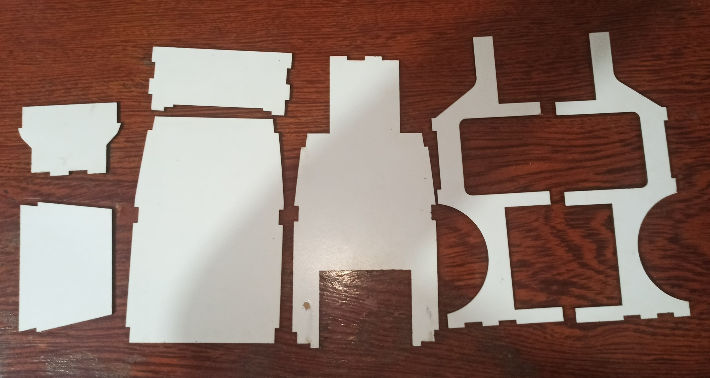{width="188mm"}

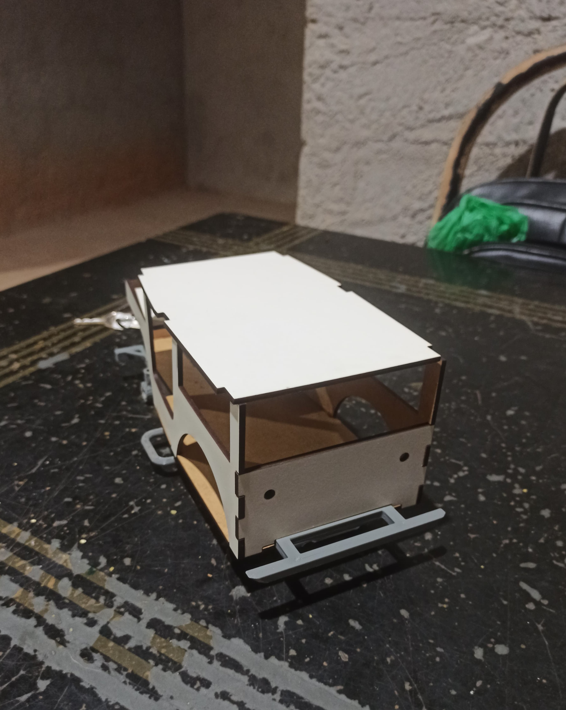{width="80mm"}

### Circuito:

-   Arduino Nano

-   Jumpers

-   Buzzer

-   LEDs

-   Resistores

-   Capacitor

-   Módulo Bluetooth

-   Driver ponte H

-   Bateria 18650

-   Servo motor

-   Motor DC

-   protoboard

O Arduino Nano foi programado para controlar os motores e receber comandos via Bluetooth. LEDs e o buzzer foram integrados ao circuito para indicar a sinalização visual e sonora funcionamento do carro. O servo motor foi utilizado para a direção, enquanto o motor DC foi responsável pela propulsão. Todos os componentes eletrônicos foram conectados em uma protoboard e realizando testes de continuidade para garantir que todas as conexões estivesse devidamente funcional, também foi realizado trabalho na estação de solda para soldar os jumper no driver ponte H garantido as conexões segura, assim podemos ver no circuito abaixo.

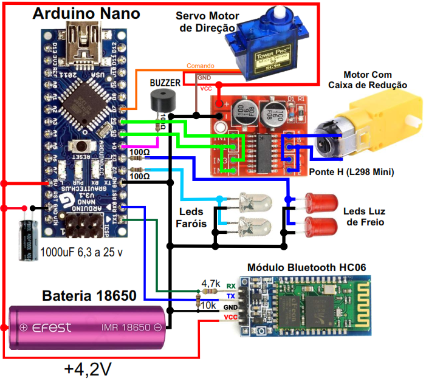{width="111mm"}

Com base no circuito acima, realizamos a montagem na protoboard e foram efetuados ajustes na programação, montagem e a mecânica, assegurando que o carro pudesse ser controlado remotamente de maneira eficiente.

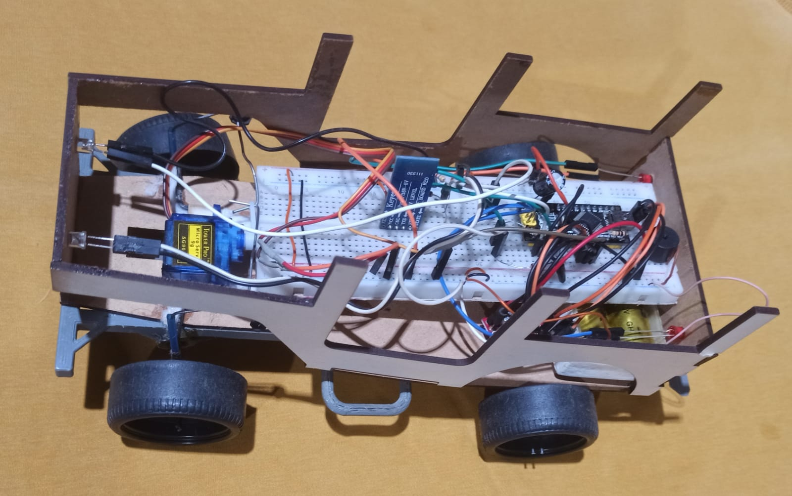{width="159mm"}

O projeto resultou em um carro de controle remoto, com um design robusto inspirado em um jeep. A combinação de tecnologias de fabricação digital permitiu a criação de componentes precisos e de alta qualidade. A integração dos componentes eletrônicos com a programação do Arduino Nano. Este trabalho demonstrou a viabilidade técnica do projeto e aprimorou as habilidades práticas dos autores em diversas áreas da engenharia e da fabricação digital.

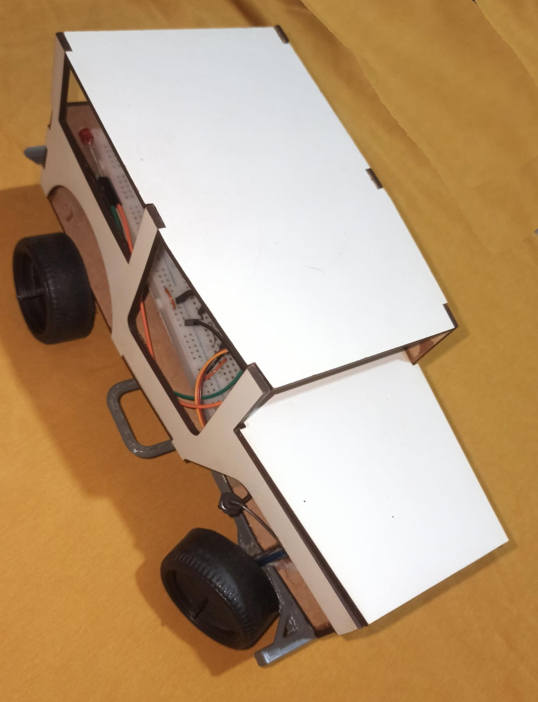{width="77mm" height="100mm"}

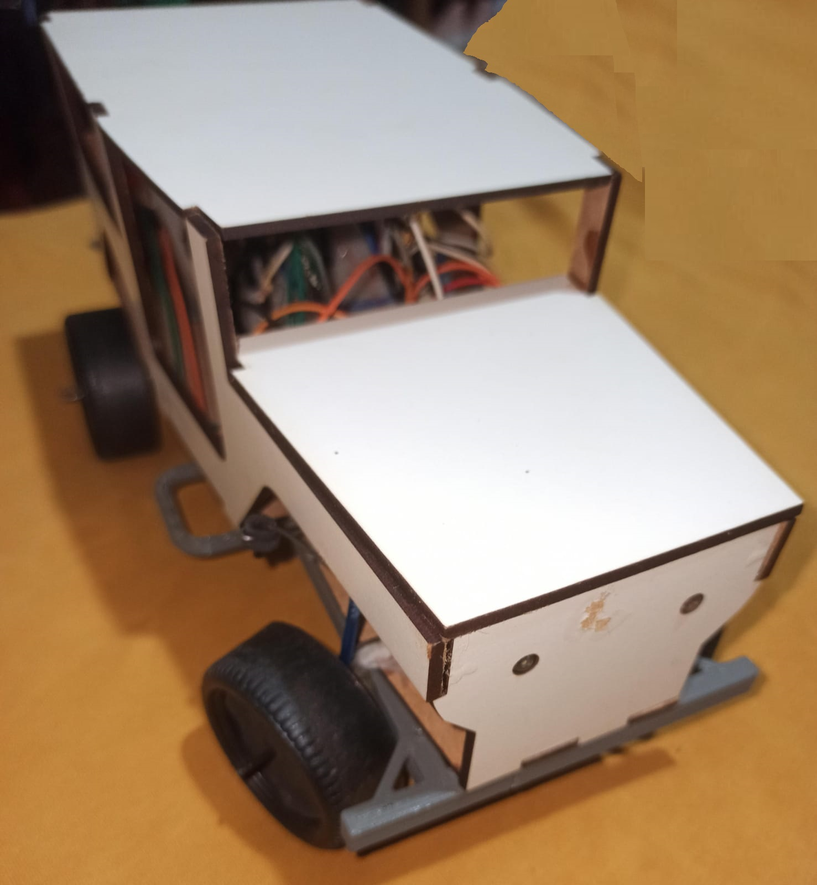{width="92mm"}

A construção do carro de controle remoto foi uma experiência prática valiosa, permitindo a aplicação de conceitos teóricos em um projeto real. O uso de técnicas de fabricação digital, como impressão 3D e corte a laser, juntamente com a integração de componentes eletrônicos, demonstrou ser uma abordagem eficaz para a criação de projetos complexos e personalizados, infelizmente por algum problema ainda não identificado, o projeto não obteve funcionamento, mas com alguns conceitos para resolver e realizar a finalidade do projeto e obter êxodo no trabalho final.
